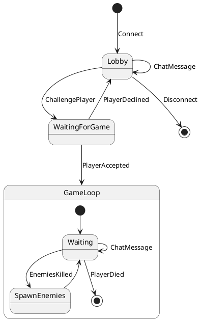

```plantuml
@startuml
[*] --> Lobby: Connect
Lobby --> Lobby: ChatMessage
Lobby --> WaitingForGame: ChallengePlayer
WaitingForGame --> GameLoop: PlayerAccepted
WaitingForGame --> Lobby: PlayerDeclined
Lobby --> [*]: Disconnect

state GameLoop {
  [*] --> Waiting
  Waiting --> SpawnEnemies: EnemiesKilled
  SpawnEnemies --> Waiting
  Waiting --> Waiting: ChatMessage
  Waiting --> [*]: PlayerDied
}
@enduml
```
